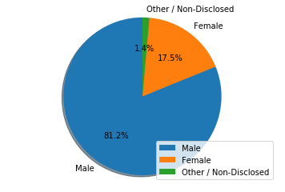

# Pymoli Purchase Data Analysis

## Top Trends As Seen in Analysis

 1. The majority of Pymoli players are males between the ages of 15-29. These players account for the majority of purchases by count and revenue. 
 2. The average purchase size is just under \$3.00. All but two players made 3 or fewer purchases.
 3. Our most popular items are $2.35 or under, which is in line with the average purchase price.
 
Potential courses of action include slightly increasing items prices, while keeping the prices under \$3.00, to earn more money off typical purchasing, or increasing the availability of items below \$2.35 to encourage more purchasing.


```python
# ------------------------------------------------------
# Step 0: Import modules
# ------------------------------------------------------
import pandas as pd
from IPython.display import display, HTML
import matplotlib.pyplot as plt
```


```python
# ------------------------------------------------------
# Step 1: Get the filename, then Read in and clean data.
# ------------------------------------------------------

# greet the user instructions
print("Welcome to Pymoli Data Analysis!")

filename = 'data/purchase_data.json'

# Read in the data file
purchases_df = pd.read_json(filename, orient='records')

# make sure everything is the right data type to use
purchases_df['Price']= purchases_df['Price'].replace("%","", regex=True).astype(float)

# check and remove null values
purchases_df.dropna(how='any')
purchases_df.to_csv("test.csv")
```

    Welcome to Pymoli Data Analysis!


----------------------------------------------------------------------------------------------------------------------
## Gender Demographics


```python
# -----------------------------------------------------------------------
# Step 2: Analyze the players: Look at 
# Total number of players & Gender demographics (Double-checked in Excel)
# -----------------------------------------------------------------------

# Total Number of players
num_players_total = len(purchases_df.groupby('SN').count())

# remove all dupes to account for players who made multiple purchases
purchases_noDupes_df = purchases_df.set_index('SN')
purchases_noDupes_df = purchases_noDupes_df[~purchases_noDupes_df.index.duplicated(keep='first')]

# count and % of male players
num_players_male = purchases_noDupes_df[purchases_noDupes_df['Gender']=='Male'].count()['Age']
percent_players_male = num_players_male/num_players_total*100

# count and % of female players
num_players_female = purchases_noDupes_df[purchases_noDupes_df['Gender']=='Female'].count()['Age']
percent_players_female = num_players_female/num_players_total*100

# count and % of other/non-disclosed players
num_players_other = purchases_noDupes_df[purchases_noDupes_df['Gender']=='Other / Non-Disclosed'].count()['Age']
percent_players_other = num_players_other/num_players_total*100

# create dataframes to hold these result
gender_demographics_num_df = pd.DataFrame.from_dict({"Male":num_players_male, "Female":num_players_female,\
                                                     "Other / Non-Disclosed":num_players_other}, orient='index')
gender_demographics_percent_df = pd.DataFrame.from_dict({"Male":percent_players_male, "Female":percent_players_female,\
                                                         "Other / Non-Disclosed":percent_players_other}, orient='index')

# merge dataframes
gender_demographics_df = gender_demographics_num_df.merge(gender_demographics_percent_df, how='outer',\
                                                            left_index=True, right_index=True)

# rename columns
gender_demographics_df.rename(columns={'0_x': 'Number of Players', '0_y': 'Percent of Players'}, inplace=True)

# format results
gender_demographics_df['Percent of Players'] = gender_demographics_df['Percent of Players'].map('{0:.2f}%'.format)

# print out results
display(gender_demographics_df)

# create labels and wedge sizes
labels = ['Male', 'Female', 'Other / Non-Disclosed']
wedge_sizes = [gender_demographics_num_df[0]['Male'],\
               gender_demographics_num_df[0]['Female'],\
               gender_demographics_num_df[0]['Other / Non-Disclosed']]

# create pie chart
fig1, ax1 = plt.subplots()
ax1.pie(wedge_sizes, labels=labels, autopct='%1.1f%%', shadow=True, startangle=90)
ax1.axis('equal')
plt.legend(loc='lower right')
plt.show()
# ----------------------------------
# End Step 2
# ----------------------------------
```


<div>
<style scoped>
    .dataframe tbody tr th:only-of-type {
        vertical-align: middle;
    }

    .dataframe tbody tr th {
        vertical-align: top;
    }

    .dataframe thead th {
        text-align: right;
    }
</style>
<table border="1" class="dataframe">
  <thead>
    <tr style="text-align: right;">
      <th></th>
      <th>Number of Players</th>
      <th>Percent of Players</th>
    </tr>
  </thead>
  <tbody>
    <tr>
      <th>Male</th>
      <td>465</td>
      <td>81.15%</td>
    </tr>
    <tr>
      <th>Female</th>
      <td>100</td>
      <td>17.45%</td>
    </tr>
    <tr>
      <th>Other / Non-Disclosed</th>
      <td>8</td>
      <td>1.40%</td>
    </tr>
  </tbody>
</table>
</div>





As can be seen above, the majority of Pymoli players are male.

--------------------------------------------------------------------------------------------------------------------------------------------------------------------------------------------------------------------------------------------
## Purchasing Analysis
### Includes Data on Top Spenders, Overall Purchasing, Purchases Split by Self-Identified Gender, & Age Demographics

### Top Spenders


```python
# ---------------------------------------------------
# Step 3: Purchasing Analysis
# 1) Top Spenders
# 2) Purchasing Analysis (Total)
# 3) Purchasing Analysis (Gender)
# 4) Age Demographics
# ---------------------------------------------------

# ---------------------------------------------------
# Question 1 - Top Spenders (Double-checked in Excel)
# ---------------------------------------------------

# identify top five spender by total puchase value
purchases_byPurchaseValue_df = purchases_df.groupby('SN').sum().sort_values('Price',ascending=False)
top_five_spenders_bySN = list(purchases_byPurchaseValue_df[0:5].reset_index()['SN'])

# create purchase count dataframe
top_five_purchase_count_df = pd.DataFrame.from_dict(dict(purchases_df[purchases_df['SN'].isin(top_five_spenders_bySN)].\
                                                         groupby('SN').count()))
top_five_purchase_count_df = top_five_purchase_count_df.drop(['Age', 'Gender', 'Item Name', 'Price'], 1)
top_five_purchase_count_df.rename(columns={'Item ID' : 'Purchase Count'}, inplace=True)

# create purchase average price dataframe
top_five_purchase_avg_df = pd.DataFrame.from_dict(dict(purchases_df[purchases_df['SN'].isin(top_five_spenders_bySN)].\
                                                       groupby('SN').mean()))
top_five_purchase_avg_df = top_five_purchase_avg_df.drop(['Age', 'Item ID'], 1)
top_five_purchase_avg_df.rename(columns={'Price' : 'Average Purchase Price'}, inplace=True)

# create total purchases dataframe
top_five_purchase_total_df = pd.DataFrame.from_dict(dict(purchases_df[purchases_df['SN'].isin(top_five_spenders_bySN)].\
                                                         groupby('SN').sum()))
top_five_purchase_total_df = top_five_purchase_total_df.drop(['Age', 'Item ID'], 1)
top_five_purchase_total_df.rename(columns={'Price' : 'Total Amount Purchased'}, inplace=True)

# merge the dataframes together to create one table
top_spenders_analysis_df = top_five_purchase_count_df.merge(top_five_purchase_avg_df, how='outer',\
                                                            left_index=True, right_index=True)
top_spenders_analysis_df = top_spenders_analysis_df.merge(top_five_purchase_total_df, how='outer',\
                                                          left_index=True, right_index=True)

# fix the formatting for the currency columns: df['cost'] = df['cost'].map('${:,.2f}'.format)
top_spenders_analysis_df['Average Purchase Price'] = top_spenders_analysis_df['Average Purchase Price'].map('${:,.2f}'.format)
top_spenders_analysis_df['Total Amount Purchased'] = top_spenders_analysis_df['Total Amount Purchased'].map('${:,.2f}'.format)

# sort by total amount purchased
top_spenders_analysis_df = top_spenders_analysis_df.sort_values('Total Amount Purchased', ascending=False)
display(top_spenders_analysis_df)
```


<div>
<style scoped>
    .dataframe tbody tr th:only-of-type {
        vertical-align: middle;
    }

    .dataframe tbody tr th {
        vertical-align: top;
    }

    .dataframe thead th {
        text-align: right;
    }
</style>
<table border="1" class="dataframe">
  <thead>
    <tr style="text-align: right;">
      <th></th>
      <th>Purchase Count</th>
      <th>Average Purchase Price</th>
      <th>Total Amount Purchased</th>
    </tr>
    <tr>
      <th>SN</th>
      <th></th>
      <th></th>
      <th></th>
    </tr>
  </thead>
  <tbody>
    <tr>
      <th>Undirrala66</th>
      <td>5</td>
      <td>$3.41</td>
      <td>$17.06</td>
    </tr>
    <tr>
      <th>Saedue76</th>
      <td>4</td>
      <td>$3.39</td>
      <td>$13.56</td>
    </tr>
    <tr>
      <th>Mindimnya67</th>
      <td>4</td>
      <td>$3.18</td>
      <td>$12.74</td>
    </tr>
    <tr>
      <th>Haellysu29</th>
      <td>3</td>
      <td>$4.24</td>
      <td>$12.73</td>
    </tr>
    <tr>
      <th>Eoda93</th>
      <td>3</td>
      <td>$3.86</td>
      <td>$11.58</td>
    </tr>
  </tbody>
</table>
</div>


Even the top spenders don't make an extraordinary number of purchases. The top 3 spenders made 4-5 purchases, and everyone else made 3 or less.

### Overall Purchasing Analysis


```python
# --------------------------------------------------------------------
# Question 2 - Purchasing Analysis (Total) (Double-checked in Excel)
# --------------------------------------------------------------------

# number of unique items purchased
num_items_unique = len(purchases_df['Item ID'].value_counts())

# average purchase price
overall_purchase_avg = '${:,.2f}'.format(purchases_df.mean()['Price'])

# total number of purchases
overall_purchase_count = purchases_df.count()['Item ID']

# total revenue
overall_purchase_revenue = '${:,.2f}'.format(purchases_df['Price'].sum())

# create dataframe to display results
purchasing_total_analysis_df = pd.DataFrame({'Number of Unique Items Purchased':[num_items_unique],\
                                             'Average Purchase Total':[overall_purchase_avg],\
                                             'Total Number of Purchases':[overall_purchase_count],\
                                             'Total Revenue':[overall_purchase_revenue]})

# rearrange columns in a more sensible way
purchasing_total_analysis_df = purchasing_total_analysis_df[['Total Revenue', 'Total Number of Purchases',\
                                                            'Average Purchase Total', 'Number of Unique Items Purchased']]
display(purchasing_total_analysis_df)
```


<div>
<style scoped>
    .dataframe tbody tr th:only-of-type {
        vertical-align: middle;
    }

    .dataframe tbody tr th {
        vertical-align: top;
    }

    .dataframe thead th {
        text-align: right;
    }
</style>
<table border="1" class="dataframe">
  <thead>
    <tr style="text-align: right;">
      <th></th>
      <th>Total Revenue</th>
      <th>Total Number of Purchases</th>
      <th>Average Purchase Total</th>
      <th>Number of Unique Items Purchased</th>
    </tr>
  </thead>
  <tbody>
    <tr>
      <th>0</th>
      <td>$2,286.33</td>
      <td>780</td>
      <td>$2.93</td>
      <td>183</td>
    </tr>
  </tbody>
</table>
</div>


The average purchase size is under $3.

### Purchasing Analysis by Gender


```python
# --------------------------------------------------------------------
# Question 3 - Purchasing Analysis (Gender) (Double-checked with Lena)
# --------------------------------------------------------------------

# purchase count by gender
gender_purchase_count_df = pd.DataFrame.from_dict(dict(purchases_df.groupby('Gender').count()))
gender_purchase_count_df = gender_purchase_count_df.drop(['Age', 'Item Name', 'SN', 'Price'], 1)
gender_purchase_count_df.rename(columns={'Item ID' : 'Purchase Count'}, inplace=True)

# average purchase price by gender
gender_purchase_avg_df = pd.DataFrame.from_dict(dict(purchases_df.groupby('Gender').mean()))
gender_purchase_avg_df = gender_purchase_avg_df.drop(['Age', 'Item ID'], 1)
gender_purchase_avg_df.rename(columns={'Price' : 'Average Purchase Price'}, inplace=True)

# sum of all purchases by gender
gender_purchase_total_df = pd.DataFrame.from_dict(dict(purchases_df.groupby('Gender').sum()))
gender_purchase_total_df = gender_purchase_total_df.drop(['Age', 'Item ID'], 1)
gender_purchase_total_df.rename(columns={'Price' : 'Total Purchases'}, inplace=True)

# create dataframe to display results
purchasing_gender_analysis_df = gender_purchase_count_df.merge(gender_purchase_total_df, how='outer',\
                                                            left_index=True, right_index=True)
purchasing_gender_analysis_df = purchasing_gender_analysis_df.merge(gender_purchase_avg_df, how='outer',\
                                                            left_index=True, right_index=True)

# add normalized totals
purchasing_gender_analysis_df['Normalized Total'] = purchasing_gender_analysis_df['Total Purchases']/gender_demographics_df['Number of Players']

# add percent count column
purchasing_gender_analysis_df['Percent Purchase (Count)'] = purchasing_gender_analysis_df['Purchase Count']/\
                                                            int(purchasing_total_analysis_df['Total Number of Purchases'])*100

# format columns
purchasing_gender_analysis_df['Total Purchases'] = purchasing_gender_analysis_df['Total Purchases'].map('${:,.2f}'.format)
purchasing_gender_analysis_df['Average Purchase Price'] = purchasing_gender_analysis_df['Average Purchase Price'].map('${:,.2f}'.format)
purchasing_gender_analysis_df['Normalized Total'] = purchasing_gender_analysis_df['Normalized Total'].map('${:,.2f}'.format)
purchasing_gender_analysis_df['Percent Purchase (Count)'] = purchasing_gender_analysis_df['Percent Purchase (Count)'].map('{0:.2f}%'.format)

# rearrange columns
purchasing_gender_analysis_df = purchasing_gender_analysis_df[['Purchase Count', 'Percent Purchase (Count)',\
                                                               'Total Purchases','Average Purchase Price',\
                                                               'Normalized Total']]

display(purchasing_gender_analysis_df)
```


<div>
<style scoped>
    .dataframe tbody tr th:only-of-type {
        vertical-align: middle;
    }

    .dataframe tbody tr th {
        vertical-align: top;
    }

    .dataframe thead th {
        text-align: right;
    }
</style>
<table border="1" class="dataframe">
  <thead>
    <tr style="text-align: right;">
      <th></th>
      <th>Purchase Count</th>
      <th>Percent Purchase (Count)</th>
      <th>Total Purchases</th>
      <th>Average Purchase Price</th>
      <th>Normalized Total</th>
    </tr>
    <tr>
      <th>Gender</th>
      <th></th>
      <th></th>
      <th></th>
      <th></th>
      <th></th>
    </tr>
  </thead>
  <tbody>
    <tr>
      <th>Female</th>
      <td>136</td>
      <td>17.44%</td>
      <td>$382.91</td>
      <td>$2.82</td>
      <td>$3.83</td>
    </tr>
    <tr>
      <th>Male</th>
      <td>633</td>
      <td>81.15%</td>
      <td>$1,867.68</td>
      <td>$2.95</td>
      <td>$4.02</td>
    </tr>
    <tr>
      <th>Other / Non-Disclosed</th>
      <td>11</td>
      <td>1.41%</td>
      <td>$35.74</td>
      <td>$3.25</td>
      <td>$4.47</td>
    </tr>
  </tbody>
</table>
</div>


Just as the majority of users are male, the majority of purchases are made by male users. They accounted for 81.15% of purchases by count and 81.69% by purchase amount.


```python
# ----------------------------------------------------------------------------
# Question 4 - Purchasing Analysis (Age) (partially double-checked with Excel)
# ----------------------------------------------------------------------------
ages_df = purchases_df.sort_values('Age')

# create bins: <10, 10-14, 15-19, 20-24, 25-29, 30-34, 35-39, 40-45, 45+
bins = [0, 10, 15, 20, 25, 30, 35, 40, 45, 100]

# name the bins
bin_names = ['<10', '10-14', '15-19', '20-24', '25-29', '30-34', '35-39', '40-44', '45+']

# create a usable version of the dataframe for analysis
purchases_df['Age Range'] = pd.cut(purchases_df['Age'], bins, labels=bin_names, right=False)

# generate dataframes with the data we need

# purchase count
age_purchase_count_df = pd.DataFrame.from_dict(dict(purchases_df.groupby('Age Range').count()))
age_purchase_count_df = age_purchase_count_df.drop(['Age', 'Gender', 'Item ID', 'Item Name', 'Price'], 1)
age_purchase_count_df.rename(columns={'SN' : 'Purchase Count'}, inplace=True)

# purchase total
age_purchase_total_df = pd.DataFrame.from_dict(dict(purchases_df.groupby('Age Range').sum()))
age_purchase_total_df = age_purchase_total_df.drop(['Age', 'Item ID'], 1)
age_purchase_total_df.rename(columns={'Price' : 'Total Purchases'}, inplace=True)

# average purchase price
age_purchase_avg_df = pd.DataFrame.from_dict(dict(purchases_df.groupby('Age Range').mean()))
age_purchase_avg_df = age_purchase_avg_df.drop(['Age', 'Item ID'], 1)
age_purchase_avg_df.rename(columns={'Price' : 'Average Purchase Price'}, inplace=True)

# create age demographics for funzies and for later use
purchases_noDupes_round2_df = purchases_df.set_index('SN')
purchases_noDupes_round2_df = purchases_noDupes_round2_df[~purchases_noDupes_round2_df.index.duplicated(keep='first')]
age_demographics_df = purchases_noDupes_round2_df.groupby('Age Range').count()
age_demographics_df = age_demographics_df.drop(['Age', 'Gender', 'Item Name', 'Price'], 1)
age_demographics_df.rename(columns={'Item ID' : 'Number of Users'}, inplace=True)

# make a dataframe to store the results
purchasing_age_analysis_df = age_demographics_df.merge(age_purchase_count_df, how='outer',\
                                                            left_index=True, right_index=True)
purchasing_age_analysis_df = purchasing_age_analysis_df.merge(age_purchase_total_df, how='outer',\
                                                            left_index=True, right_index=True)
purchasing_age_analysis_df = purchasing_age_analysis_df.merge(age_purchase_avg_df, how='outer',\
                                                            left_index=True, right_index=True)

# normalized totals
purchasing_age_analysis_df["Normalized Total"] = purchasing_age_analysis_df['Total Purchases']/age_demographics_df['Number of Users']

# format 
purchasing_age_analysis_df['Total Purchases'] = purchasing_age_analysis_df['Total Purchases'].map('${:,.2f}'.format)
purchasing_age_analysis_df['Average Purchase Price'] = purchasing_age_analysis_df['Average Purchase Price'].map('${:,.2f}'.format)
purchasing_age_analysis_df['Normalized Total'] = purchasing_age_analysis_df['Normalized Total'].map('${:,.2f}'.format)

# print results
display(purchasing_age_analysis_df)

# --------------------------------------
# End Step 3
# --------------------------------------
```


<div>
<style scoped>
    .dataframe tbody tr th:only-of-type {
        vertical-align: middle;
    }

    .dataframe tbody tr th {
        vertical-align: top;
    }

    .dataframe thead th {
        text-align: right;
    }
</style>
<table border="1" class="dataframe">
  <thead>
    <tr style="text-align: right;">
      <th></th>
      <th>Number of Users</th>
      <th>Purchase Count</th>
      <th>Total Purchases</th>
      <th>Average Purchase Price</th>
      <th>Normalized Total</th>
    </tr>
    <tr>
      <th>Age Range</th>
      <th></th>
      <th></th>
      <th></th>
      <th></th>
      <th></th>
    </tr>
  </thead>
  <tbody>
    <tr>
      <th>&lt;10</th>
      <td>19</td>
      <td>28</td>
      <td>$83.46</td>
      <td>$2.98</td>
      <td>$4.39</td>
    </tr>
    <tr>
      <th>10-14</th>
      <td>23</td>
      <td>35</td>
      <td>$96.95</td>
      <td>$2.77</td>
      <td>$4.22</td>
    </tr>
    <tr>
      <th>15-19</th>
      <td>100</td>
      <td>133</td>
      <td>$386.42</td>
      <td>$2.91</td>
      <td>$3.86</td>
    </tr>
    <tr>
      <th>20-24</th>
      <td>259</td>
      <td>336</td>
      <td>$978.77</td>
      <td>$2.91</td>
      <td>$3.78</td>
    </tr>
    <tr>
      <th>25-29</th>
      <td>87</td>
      <td>125</td>
      <td>$370.33</td>
      <td>$2.96</td>
      <td>$4.26</td>
    </tr>
    <tr>
      <th>30-34</th>
      <td>47</td>
      <td>64</td>
      <td>$197.25</td>
      <td>$3.08</td>
      <td>$4.20</td>
    </tr>
    <tr>
      <th>35-39</th>
      <td>27</td>
      <td>42</td>
      <td>$119.40</td>
      <td>$2.84</td>
      <td>$4.42</td>
    </tr>
    <tr>
      <th>40-44</th>
      <td>10</td>
      <td>16</td>
      <td>$51.03</td>
      <td>$3.19</td>
      <td>$5.10</td>
    </tr>
    <tr>
      <th>45+</th>
      <td>1</td>
      <td>1</td>
      <td>$2.72</td>
      <td>$2.72</td>
      <td>$2.72</td>
    </tr>
  </tbody>
</table>
</div>


```python
# --------------------------------------
# Step 4: Items analysis
# 1) Most Popular Items
# 2) Most Profitable Items
# --------------------------------------

# most popular items
items_byPopularity_df = purchases_df.groupby('Item ID').count().sort_values('Price', ascending=False)
top_five_item_byPopularity = list(items_byPopularity_df[0:5].reset_index()['Item ID'])

# create purchase count dataframe
top_five_item_popular_count_df = pd.DataFrame.from_dict(dict(purchases_df[purchases_df['Item ID'].isin(top_five_item_byPopularity)].\
                                                          groupby('Item ID').count()))
top_five_item_popular_count_df = top_five_item_popular_count_df.drop(['Age', 'SN', 'Gender', 'Price'], 1)
top_five_item_popular_count_df.rename(columns={'Item Name' : 'Purchase Count'}, inplace=True)

# create item price dataframe
top_five_popular_price_df = purchases_df[purchases_df['Item ID'].isin(top_five_item_byPopularity)]
top_five_popular_price_df = top_five_popular_price_df.set_index('Item ID')
top_five_popular_price_df = top_five_popular_price_df[~top_five_popular_price_df.\
                                                      index.duplicated(keep='first')].drop(['Age', 'Gender', 'Item Name',\
                                                                                            'SN','Age Range'], 1)

# create item name dataframe
top_five_popular_names_df = purchases_df[purchases_df['Item ID'].isin(top_five_item_byPopularity)]
top_five_popular_names_df = top_five_popular_names_df.set_index('Item ID')
top_five_popular_names_df = top_five_popular_names_df[~top_five_popular_names_df.\
                                                      index.duplicated(keep='first')].drop(['Age', 'Gender', 'Price',\
                                                                                            'SN','Age Range'], 1)

# create total purchases dataframe
top_five_item_popular_total_df = pd.DataFrame.from_dict(dict(purchases_df[purchases_df['Item ID'].isin(top_five_item_byPopularity)].\
                                                             groupby('Item ID').sum()))
top_five_item_popular_total_df = top_five_item_popular_total_df.drop('Age', 1)
top_five_item_popular_total_df.rename(columns={'Price' : 'Total Purchases'}, inplace=True)

# make a dataframe to store the results
top_five_items_byPurchaseCount_df = top_five_popular_names_df.merge(top_five_item_popular_count_df, how='outer',\
                                                                    left_index=True, right_index=True)
top_five_items_byPurchaseCount_df = top_five_items_byPurchaseCount_df.merge(top_five_popular_price_df, how='outer',\
                                                                              left_index=True, right_index=True)
top_five_items_byPurchaseCount_df = top_five_items_byPurchaseCount_df.merge(top_five_item_popular_total_df,\
                                                                            how='outer', left_index=True,\
                                                                            right_index=True)

# format the data
top_five_items_byPurchaseCount_df['Price'] = top_five_items_byPurchaseCount_df['Price'].map('${:,.2f}'.format)
top_five_items_byPurchaseCount_df['Total Purchases'] = top_five_items_byPurchaseCount_df['Total Purchases'].map('${:,.2f}'.format)
top_five_items_byPurchaseCount_df = top_five_items_byPurchaseCount_df.sort_values('Purchase Count',\
                                                                                    ascending=False)


display(top_five_items_byPurchaseCount_df)
```


<div>
<style scoped>
    .dataframe tbody tr th:only-of-type {
        vertical-align: middle;
    }

    .dataframe tbody tr th {
        vertical-align: top;
    }

    .dataframe thead th {
        text-align: right;
    }
</style>
<table border="1" class="dataframe">
  <thead>
    <tr style="text-align: right;">
      <th></th>
      <th>Item Name</th>
      <th>Age Range</th>
      <th>Purchase Count</th>
      <th>Price</th>
      <th>Total Purchases</th>
    </tr>
    <tr>
      <th>Item ID</th>
      <th></th>
      <th></th>
      <th></th>
      <th></th>
      <th></th>
    </tr>
  </thead>
  <tbody>
    <tr>
      <th>39</th>
      <td>Betrayal, Whisper of Grieving Widows</td>
      <td>11</td>
      <td>11</td>
      <td>$2.35</td>
      <td>$25.85</td>
    </tr>
    <tr>
      <th>84</th>
      <td>Arcane Gem</td>
      <td>11</td>
      <td>11</td>
      <td>$2.23</td>
      <td>$24.53</td>
    </tr>
    <tr>
      <th>13</th>
      <td>Serenity</td>
      <td>9</td>
      <td>9</td>
      <td>$1.49</td>
      <td>$13.41</td>
    </tr>
    <tr>
      <th>31</th>
      <td>Trickster</td>
      <td>9</td>
      <td>9</td>
      <td>$2.07</td>
      <td>$18.63</td>
    </tr>
    <tr>
      <th>175</th>
      <td>Woeful Adamantite Claymore</td>
      <td>9</td>
      <td>9</td>
      <td>$1.24</td>
      <td>$11.16</td>
    </tr>
  </tbody>
</table>
</div>


```python
# most profitable items
items_byTotalPurchases_df = purchases_df.groupby('Item ID').sum().sort_values('Price',ascending=False)
top_five_item_profit = list(items_byTotalPurchases_df[0:5].reset_index()['Item ID'])

# create purchase count dataframe
top_five_item_purchase_count_df = pd.DataFrame.from_dict(dict(purchases_df[purchases_df['Item ID'].isin(top_five_item_profit)].\
                                                         groupby('Item ID').count()))
top_five_item_purchase_count_df = top_five_item_purchase_count_df.drop(['Age', 'Age Range', 'SN', 'Gender', 'Price'], 1)
top_five_item_purchase_count_df.rename(columns={'Item Name' : 'Purchase Count'}, inplace=True)

# create item price dataframe
top_five_item_price_df = purchases_df[purchases_df['Item ID'].isin(top_five_item_profit)]
top_five_item_price_df = top_five_item_price_df.set_index('Item ID')
top_five_item_price_df = top_five_item_price_df[~top_five_item_price_df.\
                                                index.duplicated(keep='first')].drop(['Age', 'Gender', 'Item Name',\
                                                                                      'SN', 'Age Range'], 1)
# create item name dataframe
top_five_item_names_df = purchases_df[purchases_df['Item ID'].isin(top_five_item_profit)]
top_five_item_names_df = top_five_item_names_df.set_index('Item ID')
top_five_item_names_df = top_five_item_names_df[~top_five_item_names_df.\
                                                index.duplicated(keep='first')].drop(['Age', 'Gender', 'Price',\
                                                                                      'SN', 'Age Range'], 1)

# create total purchases dataframe
top_five_item_purchase_total_df = pd.DataFrame.from_dict(dict(purchases_df[purchases_df['Item ID'].isin(top_five_item_profit)].\
                                                         groupby('Item ID').sum()))
top_five_item_purchase_total_df = top_five_item_purchase_total_df.drop('Age', 1)
top_five_item_purchase_total_df.rename(columns={'Price' : 'Total Purchases'}, inplace=True)

# make a dataframe to store the results
top_five_items_byTotalPurchases_df = top_five_item_names_df.merge(top_five_item_purchase_count_df, how='outer',\
                                                                  left_index=True, right_index=True)
top_five_items_byTotalPurchases_df = top_five_items_byTotalPurchases_df.merge(top_five_item_price_df, how='outer',\
                                                                              left_index=True, right_index=True)
top_five_items_byTotalPurchases_df = top_five_items_byTotalPurchases_df.merge(top_five_item_purchase_total_df,\
                                                                              how='outer', left_index=True,\
                                                                              right_index=True)

# format the data
top_five_items_byTotalPurchases_df['Price'] = top_five_items_byTotalPurchases_df['Price'].map('${:,.2f}'.format)
top_five_items_byTotalPurchases_df['Total Purchases'] = top_five_items_byTotalPurchases_df['Total Purchases'].map('${:,.2f}'.format)
top_five_items_byTotalPurchases_df = top_five_items_byTotalPurchases_df.sort_values('Total Purchases',\
                                                                                   ascending=False)
display(top_five_items_byTotalPurchases_df)
# ----------------------------------
# End Step 4
# ----------------------------------
```


<div>
<style scoped>
    .dataframe tbody tr th:only-of-type {
        vertical-align: middle;
    }

    .dataframe tbody tr th {
        vertical-align: top;
    }

    .dataframe thead th {
        text-align: right;
    }
</style>
<table border="1" class="dataframe">
  <thead>
    <tr style="text-align: right;">
      <th></th>
      <th>Item Name</th>
      <th>Purchase Count</th>
      <th>Price</th>
      <th>Total Purchases</th>
    </tr>
    <tr>
      <th>Item ID</th>
      <th></th>
      <th></th>
      <th></th>
      <th></th>
    </tr>
  </thead>
  <tbody>
    <tr>
      <th>34</th>
      <td>Retribution Axe</td>
      <td>9</td>
      <td>$4.14</td>
      <td>$37.26</td>
    </tr>
    <tr>
      <th>115</th>
      <td>Spectral Diamond Doomblade</td>
      <td>7</td>
      <td>$4.25</td>
      <td>$29.75</td>
    </tr>
    <tr>
      <th>32</th>
      <td>Orenmir</td>
      <td>6</td>
      <td>$4.95</td>
      <td>$29.70</td>
    </tr>
    <tr>
      <th>103</th>
      <td>Singed Scalpel</td>
      <td>6</td>
      <td>$4.87</td>
      <td>$29.22</td>
    </tr>
    <tr>
      <th>107</th>
      <td>Splitter, Foe Of Subtlety</td>
      <td>8</td>
      <td>$3.61</td>
      <td>$28.88</td>
    </tr>
  </tbody>
</table>
</div>

